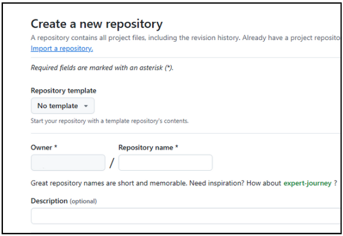
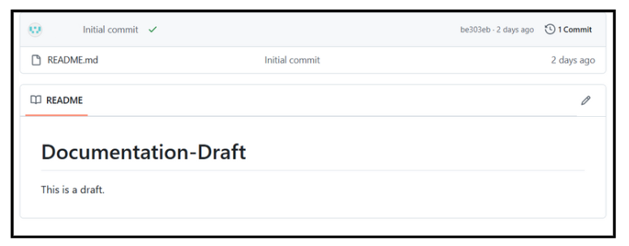
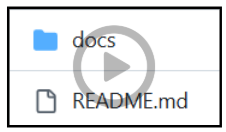
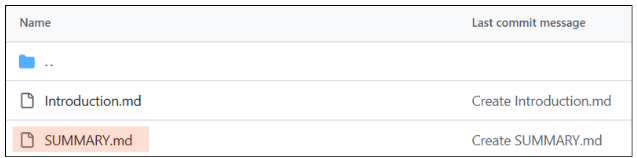

# Documentation for Structuring a GitHub Repository for GitBook
This document provides simple instructions on how to organize your content in a GitHub repository so that GitBook can read it effectively. It also includes guidelines for creating a clear navigation structure.
### 1. Structuring Your Content
To ensure that GitBook can read your content, follow these steps:

#### 1.1 Repository Setup
* **Create a New Repository:**
   - Go to GitHub and create a new repository from the `+` button at the top right corner.
  

   - Choose a name that reflects your project.
   
   ****
   ****

* **Add a `README.md` File:**
   - The `README.md` file introduces your documentation by providing a clear description of what the documentation covers, its purpose, and how to use it.
   
   - Include a short description of the documentation and provide any important links that might be useful. These links could lead to the a website, related resources, or any other related materials.

#### 1.2 Organize Your Content
* **Create a Folder:**
Make a folder in your repository to store all your documentation files, like guides and instructions. This helps keep everything organized and makes it easy for anyone to find and work on the documentation.

   - Choose the repository where you want to create a folder.
   - On the left sidebar, you’ll see the `“Create new file”` button. Click on it.
   - Enter the folder name with the format `name/`. Make sure to include the slash at the end.
   - On the right side of the page, you’ll see the Commit new file button. Click on it to create the folder.

   

* **Use Markdown Files:**
   - Create `.md (Markdown)` files for each part of your documentation. These files will contain the details for different sections, like how to use the documentation, installation steps, or any other important information.
   - Name your files in a clear and easy-to-understand way, such as `introduction.md, installation.md,` and so on. This makes it simple for anyone to find the information they need without confusion.
   - By organizing your documentation into separate files, it will be easier to manage and update, and users will be able to quickly navigate to the information they’re looking for.

 
* **Index File:**
This file will serve as a table of contents for your documentation. 
   - Create a file called `SUMMARY.md` inside your folder.

   

By having a `SUMMARY.md` file, you make it much easier for readers to navigate through your documentation. It will list all the sections and chapters in the order they should appear, helping users understand the structure of your documentation at a glance.

### 2. Creating a Clear Navigation Structure

#### 2.1 Use the SUMMARY.md File
The `SUMMARY.md` file is important for navigation. It defines the chapters and sections of your documentation. Here’s how to set it up:
* Basic Structure
   - Start with a header for your documentation.
   - List the main sections and their respective files.

#### 2.2 Keep It Logical and Simple
* **Group Related Content:** Place similar topics together.
* **Use Clear Titles:** Ensure titles are descriptive and easy to understand.
* **Limit Levels:** Try to keep navigation to a maximum of three levels deep to avoid confusion.

### 3. Final Checklist
* Repository is set up with a `README.md`.
* Folder is created.
* All content is in markdown files within the folder.
* `SUMMARY.md` is created and correctly lists all sections.

By following these instructions, you will create a well-organized GitHub repository that GitBook can easily read, offering a clear and user-friendly documentation experience.